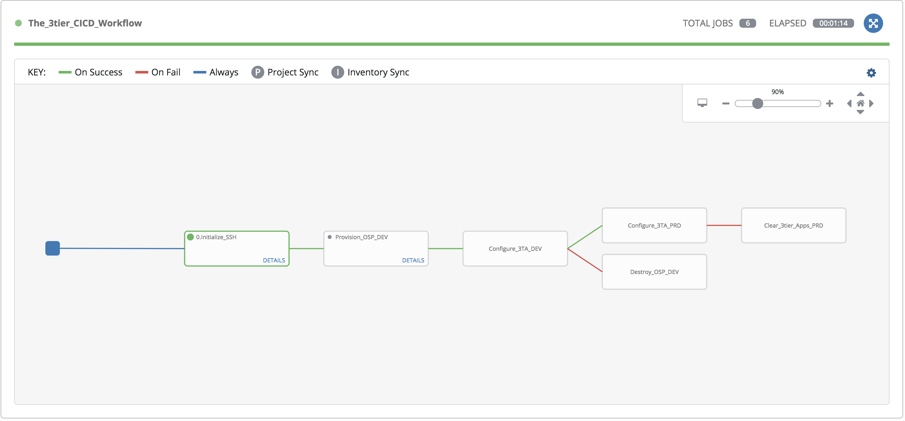
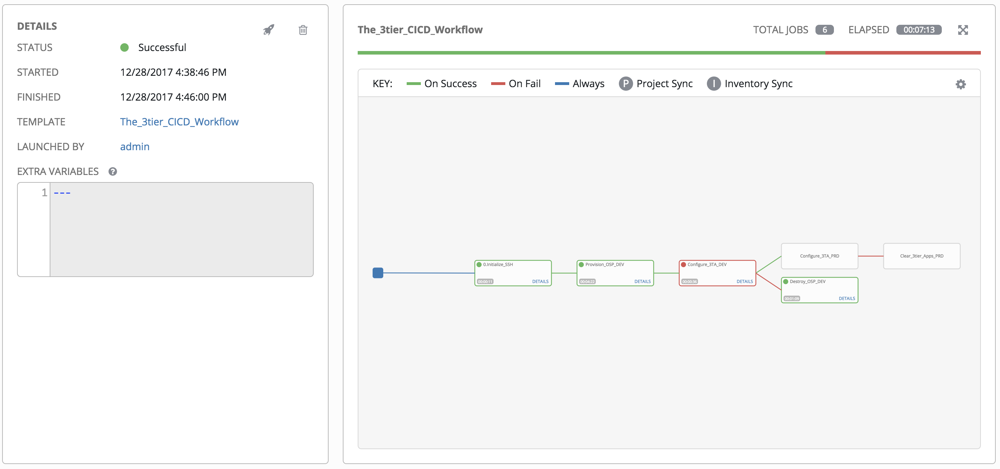

# three tier app CI/CD for Mizi telecom
- date: 2017.12.25

## Environment
- OSP workstation: workstation.5836.rhpds.opentlc.com
- Prod bastion: bastion.2a2a.example.opentlc.com
- Tower: https://tower1.2a2a.example.opentlc.com

## Basic Requirement
- git repository: https://github.com/hatsari/ansible-training.git
- Playbooks to deploy internal 3-tier app
- Install HA Ansible Tower

## Provision QA Environment (Including smoke test)
### Creating Open Stack instances
- preparation to ssh: ssh.cfg is needed to connect to jumpbox so this file can be made by playbook.
  - playbook: [Initailize_ssh.yml](Initailize_ssh.yml)
- ssh.cfg can't be saved on Tower in default, so in Tower "SETTING / CONFIGURATION / JOBS", 'ENABLE JOB ISOLATION' should be 'OFF'. 
  - 
- instances: 
  - apps(app1, app2)
  - appdbs(appdb1)
  - frontends(frontend)
- using same playbook, instances can be created or deleted depending on extra variable(dead_or_alive)
  - playbook: [Provision_OSP.yml](Provision_OSP.yml)
  - ext_var: 
    - dead_or_alive:
	  - present # when creating instances
	  - absent  # when deleting instances
	  
### Deploying 3tier app on DEV
- 3tier apps can be deploy on dev or production switching the tower's inventory
- 3tier apps are configures in each role.
- smoke test is performed using URI module
  - playbook: [Configure_3TA_OSP.yml](Configure_3TA.yml)

### Destroying Instances on DEV
- Destory all instances
- playbook: [Provision_OSP.yml](Provision_OSP.yml)
  - like explained above, it operates with extra_vars
  
## Provision Production Environment (Including smoke test)
### Creating AWS instances on PRD
- assuming that each instances are provisioned already.
- configured in tower inventory(Prod_Inventory) as static inventory.
- To deploy 3 tier app, same file [Configure_3TA_OSP.yml](Configure_3TA.yml)  is used.

### Clearing 3tier app on PRD
- not delete instances, just stop services and remove packages
- playbook: [Clean_3tier.yml](Clean_3tier.yml)

## Ansible Tower Workflow Templates
  > workflow process is compromised because to create and destroy AWS instances is not possible.
### Workflow steps
  1. initialize ssh connection environment
  1. provision instances on openstack
  1. deploy 3tier apps and verify the service using in-memory inventory
	 1. if smoke test failed, destory instances on openstack
  1. deploy 3tier apps and verify the service using tower static inventory
     1. if smoke test failed, clear 3tier apps 

-----
The 3 Tier Apps Workflow

----
Workflow Result

